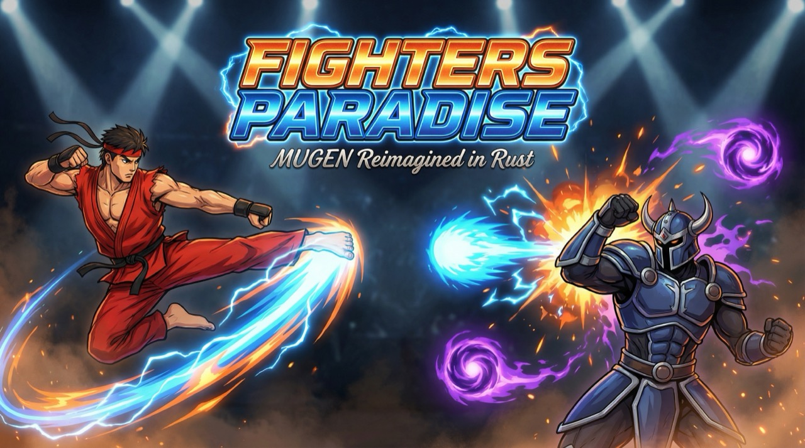

<p align="center">
  
</p>

# Fighters Paradise

<p align="center">
  A clean-room reimplementation of the <a href="https://en.wikipedia.org/wiki/Mugen_(game_engine)">MUGEN</a> 2D fighting game engine in Rust — bring your own characters, in the original MUGEN content formats (.def, .sff, .air, .cmd, .cns, .snd).
</p>

<p align="center">
  <strong>Status: v1.0 — Complete, playable fighting game.</strong> Full front-end (title → character select → stage select → fight), directory-based content discovery, Setup/Options with live key remapping, HUD/life-power-bar customization, and team Simul/Turns modes. ~2,644 tests pass; <code>clippy -D warnings</code> is clean; CI is green.
</p>

From the **Title screen** you flow through **character select → stage select → fight**, plus a **Setup/Options screen with live key remapping** and **HUD / life-power-bar customization** — all navigable by keyboard or game controller. Point `fp-app` at a game root (or a `chars/` folder directly) and the roster auto-populates from `chars/<name>/<name>.def`; stages come from `stages/`, and selectable motif/screenpack sets from `data/<motif>/` (the `--motif` flag). Team **Simul/Turns** modes are available via `--simul`/`--turns`.

The engine covers the full MUGEN state machine, combat, throws, supers (meter), hitpause, i-frames, hit reactions, jump/airjump/land, damage multipliers, helpers + projectiles + the Explod subsystem, `target`/`parent`/`root`/`helper`/`partner`/`playerid` redirects, full PalFX + true AfterImage, per-frame AIR scale/angle/Interpolate, deterministic serialization + record/replay, and broad community-content robustness (Shift-JIS CNS/CMD, SFF v2 sub-header resilience, FNT v2 detect, `FU`/`BU` command tokens, helper lifecycle/`DestroySelf`). SFF v1 and SFF v2 both render in full color.

A **GUI-free behavioral test suite** (motion synthesizer, range-of-motion table, move-execution harness) validates walk, jump, and special-move execution (QCF/DP) against the real state machine without requiring a window — those tests run on CI alongside the ~2,644-test suite. See [Known Issues](docs/known-issues.md) for remaining gaps.

## Quickstart

### Prerequisites

- **Rust** (edition 2021) — [install via rustup](https://rustup.rs/)
- **SDL2** — required for the window and keyboard input
  - macOS: `brew install sdl2`
  - Ubuntu/Debian: `apt install libsdl2-dev`
  - Windows: download from [libsdl.org](https://www.libsdl.org/download-2.0.php)

> **macOS note:** the linker needs Homebrew's libdir. This is handled automatically — [`.cargo/config.toml`](.cargo/config.toml) injects `rustflags = ["-L", "/opt/homebrew/lib"]` for `aarch64-apple-darwin`, so after `brew install sdl2` you do not need to set `RUSTFLAGS` by hand.

### Build, run, test, lint

Every operation is a plain `cargo` command. The [`Makefile`](Makefile) provides thin wrappers (run `make help` for the full self-documented list) — both columns below do the same thing:

| Task | make | cargo |
|------|------|-------|
| Build everything | `make build` | `cargo build --workspace` |
| Run (title menu, then character/stage select) | `make run` | `cargo run -p fp-app` |
| Run all tests | `make test` | `cargo test --workspace` |
| Lint (deny warnings) | `make clippy` | `cargo clippy --workspace --all-targets -- -D warnings` |
| Local CI gate | `make ci` | `clippy` + `fmt --check` + `test` |

> The `make` targets are thin wrappers with no hidden build magic, so the `cargo` column is always the source of truth. For the long-running windowed game (start/stop/restart/status), use [`scripts/fp.sh`](scripts/fp.sh) — a Makefile cannot cleanly supervise a detached GUI process.

### Run the game

```bash
cargo run -p fp-app                                  # No args: Title menu → character select → stage select → fight
cargo run -p fp-app -- <dir>                         # Discover roster from a game root or chars/ dir
cargo run -p fp-app -- --motif <name|path>           # Select a motif/screenpack
cargo run -p fp-app -- p1.def [p2.def]               # Direct match (bypasses menus)
cargo run -p fp-app -- char.def                      # Same character on both sides
cargo run -p fp-app -- --simul p1.def [p2.def]       # Team Simul mode
cargo run -p fp-app -- --turns p1.def [p2.def]       # Team Turns mode
```

If no character is found, the app degrades to an on-screen test pattern rather than crashing.

### Other CLI modes

```bash
cargo run -p fp-app -- validate char.def             # Character validator (lints a .def's assets/states)
cargo run -p fp-app -- file.sff [file.air]           # Sprite/animation viewer
```

## Controls

Player 1 is keyboard-driven (or a game controller). Controls are remappable in the in-game Setup/Options screen.

| Input | Default Keys |
|-------|------|
| Move (up / down / left / right) | `W` `S` `A` `D` or the arrow keys |
| Punches (a / b / c) | `U` / `I` / `O` |
| Kicks (x / y / z) | `J` / `K` / `L` |
| Quit | `Escape` |
| Clsn debug overlay toggle | `F1` |

## What works today

### Full front-end

- **Title screen → character select → stage select → fight** — a complete menu-driven flow navigable by keyboard or gamepad.
- **Setup/Options screen** with **live key remapping** — bind any key or gamepad button to any MUGEN action.
- **HUD/life-power-bar customization** — the `fight.def` screenpack model is loaded and rendered; customize colors and layout.
- **Directory-based content discovery** — point `fp-app` at any game root or `chars/` directory and the roster auto-populates (`chars/<name>/<name>.def`).
- **`--motif` flag** — select a MUGEN motif/screenpack from `data/<motif>/` or a direct path.
- **Team Simul and Turns modes** — via `--simul` / `--turns`.

### Engine

- **CNS state machine** — every trigger and controller parameter is compiled to an expression at load time and executed by a per-tick, MUGEN-order executor (special states −3/−2/−1, then the current state). ~40 state controllers are dispatched (including `AssertSpecial`, `Width`, `SprPriority`, `Pause`/`SuperPause`, `PalFX`/`AfterImage`, `HitOverride`, and the get-hit-vel set); unimplemented ones fall to a logged no-op rather than crashing.
- **Combat** — `Clsn1`×`Clsn2` hit detection, a faithful Guard / Hit / Miss resolution ladder, mirrored knockback, and per-side damage application.
- **Throws** — `TargetState` / `TargetBind` / `TargetLifeAdd` / `TargetFacing` / `TargetVelSet` plus the attacker's `p1stateno`, applied via the engine's deferred target-op pass.
- **Supers & meter** — a power bar fed by `PowerAdd` / `TargetPowerAdd`, carried across rounds within a match.
- **Hitpause** — impact freeze on both fighters; while frozen, only `ignorehitpause` controllers run and anim/time/physics are held.
- **I-frames** — `NotHitBy` / `HitBy` invulnerability windows consulted before a hit is applied.
- **Hit reactions** — get-hit common states and `GetHitVar` (including `animtype`) populated from the connecting `HitDef`.
- **Jump / air-jump / land** — directional jump, a built-in double-jump, and a data-driven auto-land via the ground-plane clamp. Movement (walk + jump) is unit-tested via the behavioral test suite.
- **Best-of-3 rounds** — Intro → Fight → KO → Win flow, KO and time-over resolution, draws, and first-to-N round tracking.
- **Audio** — `PlaySnd` and `HitDef` impact sounds played through a channel-managed rodio mixer (with a headless null fallback).
- **Helpers + projectiles + Explod subsystem**, `target`/`parent`/`root`/`helper`/`partner`/`playerid` redirects.
- **Deterministic serialization + record/replay**.

### GUI-free behavioral test suite

Movement and special-move execution are validated without a window through a synthesized-motion harness:

- **Motion synthesizer** — drives the input ring buffer with programmatically generated command sequences.
- **Range-of-motion table** — exercises all directional transitions and verifies state machine reactions.
- **Move-execution tests** — QCF and DP specials execute correctly via the real command recognizer and CNS executor.

These tests run on CI alongside the full ~2,644-test suite and cover the trainingdummy character's moves end to end.

Cross-entity triggers (`P2Dist`, `P2BodyDist`, edge distances, `p2`/`enemy`/`root` redirects) work via the engine's cross-entity eval context. See [MUGEN Compatibility](docs/mugen-compatibility.md) for the per-controller and per-trigger support matrix, and [Known Issues](docs/known-issues.md) for what is still missing.

## Architecture

Cargo workspace, edition 2021, 14 crates under `crates/`. No crate is a stub — `fp-stage`, `fp-ui`, and `fp-storyboard` have all graduated (some of their presentation features are still partial — see [Known Issues](docs/known-issues.md)).

```
fp-app (binary: SDL2 window, 60Hz loop, CLI + validate, full menu front-end, HUD, audio routing, debug overlay)
  ├── fp-engine        two-player Match coordinator, round/best-of-N flow, freeze, hit-spark effects
  │     ├── fp-character  loader + Character entity + per-tick executor + cross-entity eval  ← largest crate
  │     │     ├── fp-vm      CNS expression parser + tree-walk evaluator (triggers, redirects)
  │     │     ├── fp-combat  HitDef model, Clsn hit primitive, resolve_hit/resolve_clash (depends on fp-physics)
  │     │     └── fp-input   60-frame ring buffer + MUGEN command recognition
  │     └── fp-physics    Euler integration, gravity, ground plane, push/bounds (also used by fp-combat)
  ├── fp-render        wgpu palette-lookup sprite renderer (256-color indexed) + PalFX tint + text/glyphs
  ├── fp-audio         rodio WAV decode + channel-managed playback
  ├── fp-formats       parsers: SFF (v1 PCX+palette, v2 RLE/LZ5/PNG), AIR, CMD, DEF, CNS, SND, FNT, ACT
  ├── fp-storyboard    storyboard .def parser + scene model + StoryboardPlayer (intro/ending overlay)
  ├── fp-stage         stage .def parser ([BGDef]/[BG]/[Camera]/[StageInfo]) + parallax render
  ├── fp-ui            fight.def screenpack model/parser + ScreenpackHud renderer (quad-HUD fallback)
  └── fp-core          shared types: Vec2, Rect, SpriteId, FpError/FpResult
```

| Crate | Status | Tests | Role |
|-------|--------|------:|------|
| `fp-character` | Implemented | 794 | Loader, `Character` entity, per-tick executor, cross-entity eval (the biggest crate) |
| `fp-vm` | Implemented | 548 | CNS expression lexer + Pratt parser + tree-walk evaluator (+ proptest fuzz) |
| `fp-formats` | Implemented | 249 | SFF v1 (+palette)/v2 (+PNG), AIR, CMD, DEF, CNS, SND, FNT, ACT parsers |
| `fp-app` | Implemented | 215 | SDL2 window, 60Hz loop, full menu front-end, CLI + `validate`, HUD, debug overlay, match wiring |
| `fp-engine` | Implemented | 202 | Two-player `Match`, round + best-of-N flow, freeze, hit-spark effects |
| `fp-input` | Implemented | 147 | Ring buffer + command recognition (`~ / $ > +`) |
| `fp-physics` | Implemented | 90 | Euler integration, gravity, ground plane, push/bounds |
| `fp-combat` | Implemented | 84 | `HitDef` data model + `resolve_hit`/`resolve_clash` decision |
| `fp-ui` | Implemented | 75 | `fight.def` screenpack model/parser + `ScreenpackHud` renderer (quad-HUD fallback) |
| `fp-storyboard` | Implemented | 73 | Storyboard `.def` parser + scene model + `StoryboardPlayer` (intro/ending overlay) |
| `fp-render` | Implemented | 67 | wgpu renderer, WGSL palette-lookup + PalFX-tint shader, text/glyphs |
| `fp-stage` | Implemented | 43 | Stage `.def` parser + parallax background rendering |
| `fp-audio` | Implemented | 37 | rodio playback, channel cut-off, hardened WAV decode |
| `fp-core` | Implemented | 20 | Shared types (`Vec2`, `Rect`, `SpriteId`, `FpError`) |

> **Naming note:** `fp-vm` is named for a "bytecode VM," but the current implementation is a tree-walk evaluator over an AST — there is no bytecode or stack machine. The behavior (compile-at-load, evaluate-per-tick, never panic) matches the design intent. See [Architecture](docs/architecture.md).

### Design keystones

- **Fixed 60Hz tick** (16.667ms) with an accumulator loop; rendering happens once after the catch-up loop, outside the tick.
- **Struct-based entities** (not ECS), so the expression evaluator has direct field access.
- **CNS expressions compiled at load** and evaluated per tick; every error path resolves to `0` and never panics.
- **Cross-entity eval context** — a `Copy` `EvalEnv` threads the opponent/stage/anim through the executor so redirects (`p2`/`enemy`/`root`), `P2Dist`/`P2BodyDist`, and edge triggers work.
- **Deferred effects** — a tick cannot `&mut` another entity or the match, so it emits requests (sound requests, target ops, `Pause`/`SuperPause` freeze requests) into a `TickReport` that the `Match` applies; the `Match` also spawns hit-spark effect entities on a connecting hit.
- **Never crash on bad content** — parsers warn-and-skip malformed input and substitute safe defaults.

## Documentation

| Doc | What it covers |
|-----|----------------|
| [Architecture](docs/architecture.md) | Design overview, crate dependency graph, the keystone decisions |
| [MUGEN Compatibility](docs/mugen-compatibility.md) | Supported formats, controllers, and triggers — the compatibility matrix |
| [Content Guide](docs/content-guide.md) | How to structure characters and content for the engine |
| [Known Issues](docs/known-issues.md) | The honest gap list (stages auto-discovery under a game-root arg, ADX decode, etc.) |
| [Roadmap](docs/roadmap.md) | What's planned next and why |
| [Development](docs/development.md) | Build/test/lint workflow, conventions, contributing details |
| [Knowledge Base](docs/knowledge-base/) | Research + planning: MUGEN overview, ecosystem, evaluator semantics, faithfulness audit |
| [Format Specs](docs/format-specs/) | Binary/text format references (e.g. [SFF v2](docs/format-specs/sff-v2.md)) |
| [CONTRIBUTING](CONTRIBUTING.md) · [CHANGELOG](CHANGELOG.md) | Contributor guide and change log |

## MUGEN compatibility

The goal is a **completely customizable** fighting-game engine: bring your own characters in the original MUGEN formats. All six core formats parse real content today — SFF (v1 inline-PCX with trailing-palette extraction, and v2 with RLE8/RLE5/LZ5 **plus PNG8/24/32 decode**), AIR (incl. scale/angle/Interpolate), CMD, DEF, CNS, and SND. The bitmap-font (**FNT v1**) and palette (**ACT**) formats parse as well. Community-content robustness features include Shift-JIS CNS/CMD + `.def` decoding, SFF v2 sub-header resilience, `FU`/`BU` command tokens, and helper lifecycle/`DestroySelf`.

For the full picture of what loads and runs, see [MUGEN Compatibility](docs/mugen-compatibility.md); for guidance on authoring or porting characters, see the [Content Guide](docs/content-guide.md).

## Contributing

Contributions are welcome. Before opening a PR, both of these must pass clean:

```bash
cargo test --workspace
cargo clippy --workspace --all-targets -- -D warnings
```

See [CONTRIBUTING](CONTRIBUTING.md) and [Development](docs/development.md) for conventions. Note that the real-*KFM* tests are **asset-gated**: without local KFM content under `test-assets/`, they skip cleanly (which is why CI's KFM-specific tests run as no-ops — see [Known Issues](docs/known-issues.md)). CI is no longer blind to real content, though: it loads, matches, and runs the `validate` CLI against the shipped original `assets/trainingdummy` character on every push.

## Clean-room & content

Fighters Paradise is a **clean-room** project: **no Elecbyte/MUGEN engine source or copyrighted assets are shipped or tracked.** The only tracked content is the project's own **original** assets:

- `assets/banner.png` — the project banner.
- `assets/trainingdummy/` — a from-scratch MIT conformance character (the shippable default and CI fixture).
- `assets/data/` — original MIT assets: `fightfx.sff`/`fightfx.air` (hit-spark effects, procedurally authored), `font.fnt` (a 5×7 block bitmap font), `common1.cns` (independent reimplementation of the MUGEN engine-common states), `system.def` + `select.def` (the default clean-room motif: original title menu, select grid geometry, and roster).
- `assets/stages/dojo/bg.png` — an original AI-generated dojo-stage backdrop (MIT).

Kung Fu Man (CC BY-NC 3.0, by Elecbyte) is used **locally only** for testing — `test-assets/` is a gitignored symlink, and no third-party asset files are committed. Please do not commit any third-party content.

## License

This project's code is licensed under the MIT License. See [LICENSE](LICENSE) for details.

Fighters Paradise is an independent project. MUGEN is a trademark of Elecbyte. This project does not include any Elecbyte code or assets.
